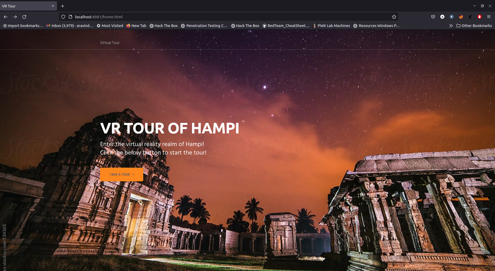
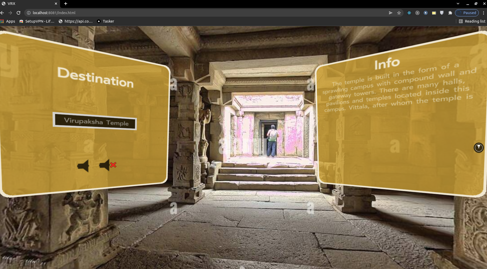
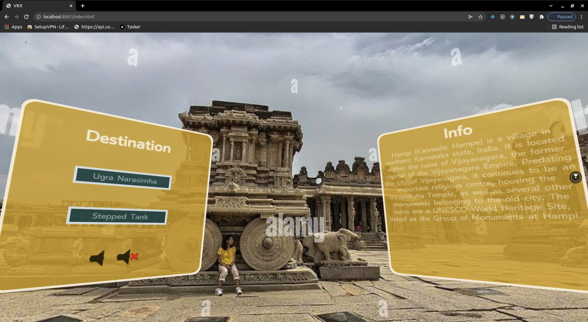
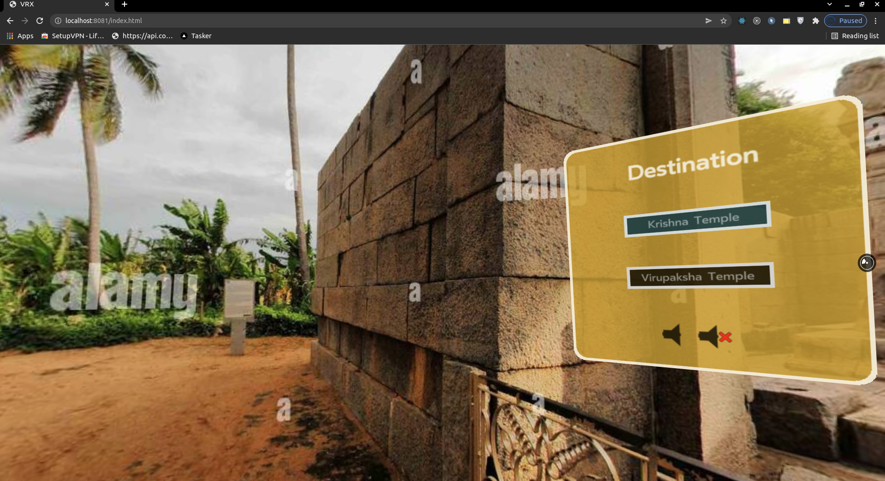

## About
Creating VR Experiences with React 360 in Web.

## Description
This project aims to function as a tour of historic places for people, to look and
explore around in an virtual space. Each of the area can be linked through VR buttons to explore
them in a VR Environment. The similarity to the real world presents a case where it may be truly
immersive for the user in VR given the simplicity of the interactions between the users and the virtual
world. Additionally, the users have freedom of viewing the architectural wonders from their own
place safely without any distant travelling or can be used for planning visits in near future.

## Screenshots






## Dependencies
react
react-360
react-360-web
react-native
three
webvr-polyfill

### Install and Run
```
1.  npm install
2.  npm start
3.  open "http://localhost:8081/home.html"
```
